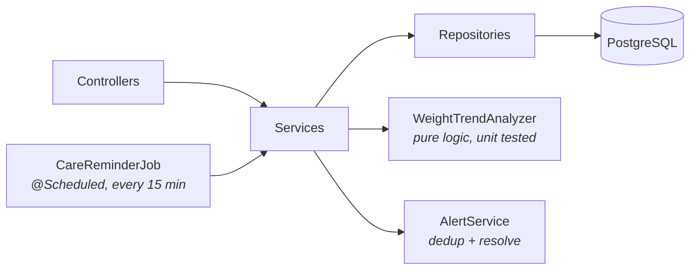
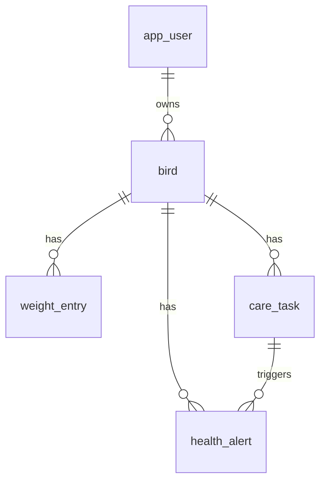

<div align="center">

# 🪶 FeatherLog

**A REST API that turns daily budgie weigh-ins into early health warnings.**

[](https://github.com/arinazhou/featherlog/actions/workflows/ci.yml)


[Why](#why) · [Quick start](#quick-start) · [Features](#features) · [API](#api-reference) · [Architecture](#architecture) · [Testing](#testing)

</div>

---

## Why

I built this for my blue budgie.

Budgies hide illness very well. By the time a small bird *looks* sick, it has often been unwell for a while. One of the few early signs you can measure is **gradual weight loss**, and it's easy to miss: a 35 g budgie that loses 3–4 g has already dropped 10%, and you won't see that by eye.

FeatherLog does two things:

1. 📉 **Watches weight trends** from kitchen-scale weigh-ins and raises alerts before the bird looks sick.
2. 🗓️ **Keeps the care routine on schedule**: water, food, greens, cage cleaning, vet visits.

## Quick start

**Requirements:** Docker. For running outside Docker you also need Java 21.

```bash
git clone https://github.com/arinazhou/featherlog.git
cd featherlog
docker compose up --build
```

That starts the API and PostgreSQL. Then open:

| | URL |
|---|---|
| Swagger UI | http://localhost:8080/swagger-ui.html |
| Health check | http://localhost:8080/actuator/health |

<details>
<summary><b>Run the app outside Docker</b></summary>

Start only the database in Docker, then run the app from your IDE or terminal:

```bash
docker compose up -d db
./mvnw spring-boot:run
```

</details>

<details>
<summary><b>Run the tests</b></summary>

No database needed. Tests use in-memory H2 in PostgreSQL mode.

```bash
./mvnw test
```

</details>

## Features

### 📉 Weight trend analysis

`WeightTrendAnalyzer` compares each bird against **its own history**, not a generic chart:

- **Baseline** is the **median** of weigh-ins from 7–30 days ago. The median holds up against a one-off reading taken right after a meal.
- **Recent** is the mean of the last 7 days.

Every new weigh-in is checked against these rules:

| Alert | Fires when | Severity |
|---|---|---|
| `WEIGHT_DROP` | Recent average is ≥ 5% below baseline | ⚠️ WARNING |
| `WEIGHT_DROP` | Recent average is ≥ 10% below baseline | 🚨 CRITICAL |
| `RAPID_WEIGHT_CHANGE` | Two consecutive readings < 72 h apart differ by ≥ 7% | ⚠️ WARNING |
| `OUT_OF_RANGE` | Latest reading is outside the bird's target range (default 30–40 g) | ⚠️ WARNING |
| `CARE_OVERDUE` | A care task is past its due time | ⚠️ WARNING |

Alerts are **de-duplicated**: a bad week of weigh-ins opens one alert, not one per reading.

### 🗓️ Care schedules

Each new bird gets a default budgie routine:

| Task | Every |
|---|---|
| Change drinking water | 1 day |
| Refresh seed/pellets and remove husks | 1 day |
| Offer fresh vegetables | 2 days |
| Deep clean cage and perches | 7 days |
| Check cuttlebone and mineral block | 14 days |
| Check nails and beak length | 30 days |
| Avian vet wellness exam | 365 days |

- Completing a task reschedules it from the time it was completed.
- A scheduled job runs **every 15 minutes** and opens a `CARE_OVERDUE` alert for each overdue task. It's safe to run repeatedly, and completing the task resolves its alert.
- You can add custom tasks with your own interval.

### 🩺 Health dashboard

`GET /api/birds/{id}/health` returns weight status (`HEALTHY`, `WATCH`, `CONCERN`, or `INSUFFICIENT_DATA`), open alerts, and the overdue task count in one call.

### 🔒 Security

- **JWT authentication.** Stateless bearer tokens signed with HS256 through Spring Security's OAuth2 resource server. Passwords are hashed with BCrypt.
- **Per-user data isolation.** Every bird-scoped query filters on the owner. Requesting another user's bird returns `404`, not `403`, so bird IDs don't leak.

### ⚙️ Production basics

Flyway migrations · PostgreSQL · RFC 7807 `ProblemDetail` errors with per-field validation messages · paginated history · OpenAPI / Swagger UI · Actuator health · Docker Compose · GitHub Actions CI

## API reference

All endpoints except register and login need an `Authorization: Bearer <token>` header.

| Method | Path | Description |
|---|---|---|
| `POST` | `/api/auth/register` | Create an account and get a JWT |
| `POST` | `/api/auth/login` | Log in and get a JWT |
| `GET` `POST` | `/api/birds` | List or create birds |
| `GET` `PUT` `DELETE` | `/api/birds/{id}` | Read, update, or delete a bird |
| `GET` `POST` | `/api/birds/{id}/weights` | Paged history (`?page=&size=`) or log a weigh-in |
| `GET` | `/api/birds/{id}/health` | Weight assessment, open alerts, overdue care |
| `GET` `POST` | `/api/birds/{id}/care-tasks` | List or add recurring tasks |
| `POST` | `/api/birds/{id}/care-tasks/{taskId}/complete` | Mark a task done and reschedule it |
| `DELETE` | `/api/birds/{id}/care-tasks/{taskId}` | Deactivate a task |
| `GET` | `/api/alerts?open=true` | Alerts across all your birds |
| `POST` | `/api/alerts/{id}/resolve` | Resolve an alert |

### Walkthrough

These examples use `curl` and [`jq`](https://jqlang.github.io/jq/).

**1. Register and save the token**

```bash
TOKEN=$(curl -s -X POST localhost:8080/api/auth/register \
  -H 'Content-Type: application/json' \
  -d '{"email":"me@example.com","password":"password123","displayName":"Me"}' | jq -r .accessToken)
```

**2. Add a bird.** Species and weight range default to typical budgie values.

```bash
curl -s -X POST localhost:8080/api/birds -H "Authorization: Bearer $TOKEN" \
  -H 'Content-Type: application/json' \
  -d '{"name":"Sky","colorMutation":"Sky Blue","sex":"MALE"}'
```

**3. Log a morning weigh-in.** The response includes the updated assessment and any new alerts.

```bash
curl -s -X POST localhost:8080/api/birds/1/weights -H "Authorization: Bearer $TOKEN" \
  -H 'Content-Type: application/json' -d '{"grams":34.6}'
```

**4. Check the health summary**

```bash
curl -s localhost:8080/api/birds/1/health -H "Authorization: Bearer $TOKEN"
```

**5. See today's care tasks and mark water as done**

```bash
curl -s localhost:8080/api/birds/1/care-tasks -H "Authorization: Bearer $TOKEN"
curl -s -X POST localhost:8080/api/birds/1/care-tasks/1/complete -H "Authorization: Bearer $TOKEN"
```

## Architecture



- **Organized by feature**, not by layer: `auth`, `bird`, `weight`, `care`, `alert`.
- **`WeightTrendAnalyzer` has no Spring or JPA dependencies**, so the health rules are plain unit-testable logic.
- **Time is injectable.** A `java.time.Clock` bean is used everywhere time matters, including JWT expiry checks. Tests can move time forward ("30 hours later, is the water change overdue?") without sleeping.

### Data model



`care_task.next_due_at` is stored and indexed together with `active`, so the reminder job finds overdue tasks with one indexed query instead of computing due dates in memory.

## Tech stack

| Area | Tools |
|---|---|
| Language & framework | Java 21, Spring Boot 3.5 (Web, Data JPA, Security, Validation, Actuator) |
| Data | PostgreSQL 16, Flyway |
| API docs | springdoc-openapi (Swagger UI) |
| Testing | JUnit 5, MockMvc, AssertJ, H2 |
| Ops | Docker, Docker Compose, GitHub Actions |

## Testing

| Test | Covers |
|---|---|
| `WeightTrendAnalyzerTest` | Baseline and median behavior, WARNING/CRITICAL thresholds, rapid-change detection, target range, ignoring future readings |
| `CareTaskTest` | Scheduling rules for care tasks |
| `BirdApiTest`, `HealthMonitoringApiTest` | Full-stack MockMvc tests: auth (401/409), cross-user isolation, validation errors, a two-week weight decline that raises exactly one alert, pagination, and overdue reminders driven by a controllable clock |

## Roadmap

- [ ] Push or email notifications for CRITICAL alerts
- [ ] Daily observation log (appetite, droppings, activity) that feeds into health status
- [ ] Molt-season awareness (weight often dips slightly during a heavy molt)
- [ ] Testcontainers integration tests against real PostgreSQL
